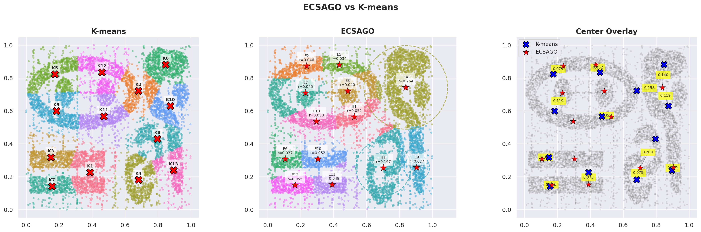

# pyecsago

Python implementation of **ECSAGO** (Evolutionary Clustering with Self-Adaptive Genetic Operators), a robust evolutionary clustering algorithm that automatically discovers the number of clusters in data while being resistant to noise.



## Features

- **Automatic cluster detection** — no need to specify *k* in advance
- **Noise-robust** density-based fitness function (RBF kernel weights)
- **Self-adaptive operators** via HAEA (Hybrid Adaptive Evolutionary Algorithm)
- **Deterministic Crowding** for niche maintenance
- **MDE refinement** (Maximal Density Estimator) for prototype center/spread convergence
- **GPU acceleration** — optional CUDA support via CuPy

## Installation

CPU only:

```bash
pip install pyecsago
```

With CUDA support:

```bash
pip install pyecsago[cuda]
```

### From source

```bash
git clone https://github.com/pwnaoj/pyecsago
cd pyecsago
pip install .
```

## Quick start

```python
import numpy as np
from pyecsago import ECSAGO

# Sample data: 3 Gaussian clusters
data = np.vstack([
    np.random.randn(100, 2) + [0, 0],
    np.random.randn(100, 2) + [5, 5],
    np.random.randn(100, 2) + [10, 0],
])

config = {
    "population_size": 100,
    "weight_threshold": 0.3,
    "max_generations": 30,
    "iterations": 10,
    "extraction_type": {2: 0.25},   # PROPORTION_MAX with 25% threshold
    "k": 13.8,
    "use_cuda": False,
}

ecsago = ECSAGO(config)
results = ecsago.run(data)

prototypes = results["refined_prototypes"]
labels = results["cluster_assignments"]

print(f"Clusters found: {len(prototypes)}")
```

## Step-by-step usage

For finer control you can invoke each stage independently:

```python
ecsago = ECSAGO(config)

# 1. Load data
ecsago.context.set_data(data)

# 2. Evolve the population
ecsago.evolve()

# 3. Extract prototypes
prototypes = ecsago.extract_prototypes(
    extraction_type={2: 0.25},
    k=13.8,
)

# 4. Refine with MDE
refined = ecsago.refine_prototypes(
    prototypes=prototypes,
    iterations=10,
    k=13.8,
)
```

## Configuration

All parameters are passed as a dictionary to `ECSAGO(config)`.

| Parameter | Type | Description |
|---|---|---|
| `population_size` | `int` | Number of individuals in the evolutionary population |
| `weight_threshold` | `float` | Threshold for weight binarization (0–1) |
| `max_generations` | `int` | Maximum number of evolutionary generations |
| `iterations` | `int` | Number of MDE refinement iterations |
| `extraction_type` | `dict` | Extraction method — key is the type (0–4), value is the threshold |
| `k` | `float` | Chi-squared factor for minimum inter-prototype distance |
| `use_cuda` | `bool` | Enable CUDA/GPU acceleration via CuPy |

### Extraction types

| Key | Method | Threshold meaning |
|---|---|---|
| 0 | `ABSOLUTE_VALUE` | Absolute fitness threshold (auto-calculated) |
| 1 | `PROPORTION_AVG` | Proportion of average fitness |
| 2 | `PROPORTION_MAX` | Proportion of maximum fitness |
| 3 | `PROPORTION_MEDIAN` | Proportion of median fitness |
| 4 | `MINIMUM_DENSITY` | Based on minimum density |

## Output

`ecsago.run(data)` returns a dictionary:

| Key | Description |
|---|---|
| `final_population` | Full evolved population |
| `prototypes` | Extracted prototypes (before refinement) |
| `refined_prototypes` | Refined prototypes (after MDE) |
| `cluster_assignments` | Cluster label for each data point |

Each prototype is an `ECSAGOIndividual` with attributes `genome` (center), `sigma2` (spread), and `fitness`.

## Architecture

```
pyecsago/
├── core/               # Abstract base classes and exceptions
├── implementations/
│   └── ecsago/         # ECSAGO algorithm, context, individual, population
├── strategies/
│   ├── evolution/      # Evolution strategy (HAEA + Deterministic Crowding)
│   ├── extraction/     # Prototype extraction (fitness, niche, composite)
│   ├── fitness/        # Fitness calculation (CPU and CUDA)
│   ├── niching/        # Deterministic Crowding
│   ├── operators/      # Genetic operators (mutation, crossover, HAEA)
│   └── refinement/     # MDE refinement (CPU and CUDA)
└── utils/              # Data type strategies, compatibility, utilities
```

## License

**pyecsago** was created by Joan Sebastian Tamayo Rivera. It is licensed under the terms of the MIT license.

## References

- León, E. *"Scalable and Adaptive Evolutionary Clustering for Noisy and Dynamic Data"*
- León, E., Nasraoui, O., & Gómez, J. *"ECSAGO: Evolutionary Clustering with Self-Adaptive Genetic Operators"*
- Gómez, J. *"Self Adaptation of Operator Rates for Multimodal Optimization"*
- Tamayo, J. *"GPU/CUDA-Based Parallelization of the ECSAGO Evolutionary Algorithm"*
